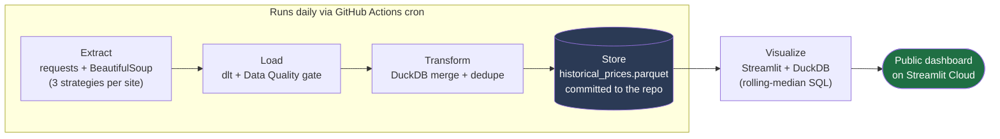

# Fake Discount Deception Engine

A free, automated data pipeline that tracks real historical prices on e-commerce sites and flags discounts that are not genuine.

**Stack:** Python, dlt, DuckDB, GitHub Actions, Streamlit
**License:** MIT
**Hosting cost:** $0/month

---

## The Problem

Retailers frequently raise a product's listed "original price" immediately before running a promotion. This makes the advertised discount look larger than it actually is, even when the sale price is close to, or identical to, the price the item is normally sold at. Because no public record of price history exists for most products, this practice is difficult for a shopper to verify or catch.

The following example was captured during testing of this pipeline, for a hair straightener listed on Nykaa:

| Metric | Value |
|---|---|
| Listed "original" price (MRP) | ₹1,595 |
| Advertised "sale" price | ₹999 |
| Discount claimed by the site | 37% |
| Actual 30-day median price | ₹995 |
| Actual discount vs. 30-day median | ~0% |

The advertised "sale" price is, in practice, the item's normal price. The 37% discount is calculated against a reference price that does not reflect what the item has actually sold for.

## The Solution

This pipeline scrapes the real price of a small set of tracked products every day, stores the full price history, and calculates each item's **True Median Price**. It then compares the discount a retailer claims against the discount a shopper is actually getting, based on that item's own price history.

The entire system runs on free infrastructure: GitHub Actions for scheduling and compute, a Parquet file committed to the repository for storage, and Streamlit Community Cloud for the dashboard. No database server, cloud account, or paid tier is required.

## Architecture



Every stage is a standard Python process. There is no always-on server and no cron daemon to maintain: GitHub Actions is the scheduler, and a Parquet file committed to the repository is the data warehouse.

## Tech Stack

| Stage | Tool | Reason |
|---|---|---|
| Extraction | requests + BeautifulSoup | No headless browser required for 2 of the 3 target sites — see Engineering Notes |
| Load | dlt (Data Load Tool) | Handles schema creation and evolution automatically; no hand-written ALTER TABLE statements |
| Transform & Storage | DuckDB → Parquet | An embedded OLAP engine writing to a single file, at zero infrastructure cost |
| Orchestration | GitHub Actions | Free scheduled compute; git history doubles as an audit log of every day's data |
| Visualization | Streamlit + DuckDB | Queries the Parquet file directly with SQL; no separate database to provision |

## How It Works

1. `src/config.py` defines which products to track and which extraction strategy each site requires (see Engineering Notes — this is not one-size-fits-all).
2. `src/scrapers.py` fetches today's price using that strategy and returns a plain record, or a clear error if the fetch failed.
3. `src/pipeline.py` (dlt) runs every record through a Data Quality gate before it reaches storage: a $0, NULL, or implausible price is dropped and logged rather than allowed to corrupt the historical median.
4. `src/transform.py` (DuckDB) merges today's clean rows into `data/historical_prices.parquet`, keeping only the latest scrape per product per day. Re-running the pipeline does not create duplicate rows.
5. GitHub Actions commits the updated Parquet file back to `main` every day at 00:00 UTC.
6. `app.py` (Streamlit) reads that file directly with a DuckDB window-function query, calculates each product's rolling 30-day median, and displays the gap between the claimed discount and the actual one.

## Engineering Notes

- **Extraction strategy differs by site.** Each of the three target sites was inspected directly before writing extraction code:
  - The grocery item's store runs on Shopify, which exposes a free, stable `<product-url>.json` endpoint on every product page. No HTML parsing is required.
  - The electronics retailer embeds price in an Open Graph `<meta property="product:price:amount">` tag. This is SEO-driven and is not affected by visual redesigns that would break a CSS selector.
  - The apparel site is a JavaScript single-page application; the price does not appear in the static HTML at all. This strategy is left as an explicit, documented TODO (`api_url: None`) that fails safely through the Data Quality gate rather than returning an incorrect value.
- **A $0 or NULL price is treated as a scrape failure, not a real price.** Letting such a value into the historical record would distort the rolling median and cause every subsequent day to be misreported as a large discount.
- **The merge step is idempotent.** Running the pipeline twice for the same day does not duplicate rows; only the latest scrape per (product, date) is kept.
- **DuckDB is the SQL engine end-to-end**, from the merge and deduplication logic to the dashboard's rolling-median calculation. There is no separate pandas merge logic to maintain.

## Repository Structure

```
fake-discount-deception-engine/
├── .github/workflows/
│   └── daily_scrape.yml           # cron + manual trigger, auto-commits the parquet file
├── data/
│   └── historical_prices.parquet  # created on first run, updated daily by CI
├── src/
│   ├── config.py                  # what to track and which strategy to use
│   ├── scrapers.py                # extraction logic, isolated from orchestration
│   ├── pipeline.py                # dlt extract+load and the Data Quality gate
│   └── transform.py               # DuckDB merge into the historical parquet
├── app.py                         # Streamlit dashboard
├── run_pipeline.py                # single entrypoint (local + CI)
├── requirements.txt
└── .gitignore
```

## Local Setup

```bash
git clone https://github.com/YOUR_USERNAME/fake-discount-deception-engine.git
cd fake-discount-deception-engine

python3.12 -m venv .venv
source .venv/bin/activate        # Windows: .venv\Scripts\activate
python -m pip install -r requirements.txt

python run_pipeline.py           # scrapes prices and populates data/historical_prices.parquet
python -m streamlit run app.py   # opens the dashboard at localhost:8501
```

## Testing & Validation

The pipeline was run end-to-end before release, not just unit-tested in isolation:

- The Data Quality gate was tested against six broken-scraper scenarios ($0, NULL, a negative price, a request timeout, an implausibly large value, and an inverted original/current price). All six were correctly rejected with a logged reason.
- A 35-day synthetic price history, including one genuine discount event, was used to confirm that the rolling-median calculation and the claimed-vs-actual discount logic produce correct results.
- The merge step was executed twice for the same simulated day to confirm it does not create duplicate rows.
- `run_pipeline.py` was executed as the literal entrypoint GitHub Actions calls, against realistic mocked HTTP responses for each extraction strategy.

## Known Limitations & Roadmap

- The apparel example (Uniqlo) requires its hidden API endpoint to be identified manually — see the `hidden_api` strategy notes in `src/config.py`. Until configured, it is excluded by the Data Quality gate rather than reporting an unverified price.
- Only three products are tracked currently. `config.py` is structured so that adding more is a data change, not a code change.
- No alerting is implemented yet. A logical next step is a Slack or email notification when a tracked product crosses into genuine-deal territory.
- Price history begins from the pipeline's first run; there is no backfill of prices from before that date.

## License

This project is licensed under the MIT License. See the [LICENSE](LICENSE) file for the full text.

## Author

Built by Ziaur Rahman Ansari as a data engineering portfolio project.
LinkedIn: [https://www.linkedin.com/in/ziaur-rahman-ansari-0177071b9/] · GitHub: [https://github.com/Rahmman001]